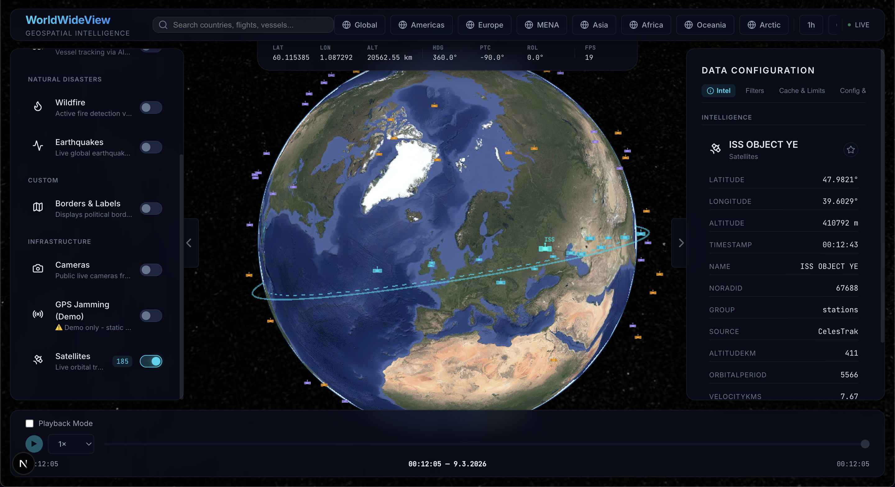

# WorldWideView

**WorldWideView** is a modular, real-time geospatial intelligence engine built on top of a CesiumJS 3D globe. It is designed to ingest live data streams, transform them through a generalized plugin system, and render them as high-performance visual layers.

As a real-time situational awareness platform, it turns raw geospatial signals—such as aircraft positions, maritime AIS, or satellite orbits—into interactive, cinematic layers on a high-fidelity 3D globe.



## Current Data Layers

### Aviation
- **Real-time aircraft tracking** via OpenSky Network
- **Military aircraft detection** using callsign patterns and ICAO address ranges
- **Visual distinction**: Military aircraft rendered in orange, civilian in blue/purple gradient by altitude
- **10,000+ live aircraft** with smooth interpolation between updates
- **Filters**: Military status, country, altitude, speed

### Satellites
- **Live orbital tracking** with TLE propagation using satellite.js
- **Orbit path visualization** for selected satellites
- **Ground track projection** showing earth surface path
- **Groups**: Space stations (ISS, Tiangong), GPS, Weather, Starlink
- **Real-time position extrapolation** for smooth orbital motion
- ⚠️ **Note**: CelesTrak API used

### Maritime
- **Vessel tracking** with type-based color coding
- **Dynamic sizing**: Larger icons for moving vessels
- **Ship icon** with heading orientation
- **Demo data** (AIS integration planned)

### GPS Jamming
- **Real data** from gpsjam.org (H3 hexagon polygons)
- **Date resolution**: manifest or fallback (today → previous days) for latest available dataset
- **Color-coded by severity** (yellow/amber/red by affected aircraft %)
- **Server-side caching** (Cache & Limits); no dummy or fallback polygons when source unavailable

### Earthquakes
- **Live USGS earthquake data** (past 24 hours)
- **Visual encoding**: 
  - Marker color by USGS alert level (green/yellow/orange/red)
  - Marker size by magnitude
  - Ellipse area showing approximate impact radius
- **Real-time updates** every 5 minutes

### Borders & Labels
- **Political boundaries** with country labels
- **Toggle visibility** for decluttered views

### Public Cameras
- **Live camera feeds** from around the world
- **Click to view stream**

## Key Philosophies

- **Modular Intelligence**: Every data source is a plugin. The core engine is data-agnostic.
- **High-Performance Rendering**: Engineered for scale using Cesium primitives to handle 100,000+ objects smoothly.
- **Situational Awareness**: Designed for real-time updates and cinematic visualization (orientated icons, smooth tracking).
- **Extensible & Open**: Add new intelligence layers without touching the core architecture.

## Quick Start

```bash
git clone https://github.com/s3vdev/worldwideview.git
cd worldwideview
npm install
npm run dev
```

Visit `http://localhost:3000` to see the live globe.

## Fair-Use Notice

This application may contain copyrighted material the use of which has not always been specifically authorized by the copyright owner. Such material is made available for educational purposes, situational awareness, and to advance understanding of global events. It is believed that this constitutes a "fair use" of any such copyrighted material as provided for in section 107 of the US Copyright Law.

## Key Documentation Sections

- **[Setup & Installation Guide](docs/SETUP.md)**: Detailed environment and local development setup.
- **[Architecture (Engineering Depth)](docs/ARCHITECTURE.md)**: Deep dive into the Cesium rendering pipeline, event data bus, and performance optimizations.
- **[Plugin System Guide](docs/PLUGIN_GUIDE.md)**: How to build and register custom data layers.
- **[User Guide](docs/USER_GUIDE.md)**: Application features and navigation tips.

---

For a full list of resources, see the **[Documentation Index](docs/index.md)**.
